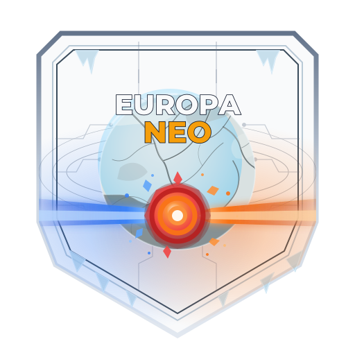

# Europa Neo

<div align="center">

<picture>
  <source media="(prefers-color-scheme: dark)" srcset="docs/manual/assets/brand/europa-neo-lockup-dark.svg">
  
</picture>

Real-time nanobot warfare on Jupiter's icy moon — rebuilt for the modern web.

</div>

[](LICENSE)

Current release: **v0.2.0**

## What is Europa Neo?

Europa Neo is a modern, open-source reimplementation of **Europa**, the groundbreaking 1990s Java applet game of real-time nanobot warfare. Two to four commanders land on Europa with self-replicating nanobot colonies: cities produce troops, pipes direct their flow across a hostile landscape, and fog of war means you only ever see what your nanobots can sense.

It is a faithful rebuild of the original core loop — cities, pipes, combat, paratroopers, guns — with a modernized interface and none of the 1990s friction. Everything runs in the browser over WebSockets against a server-authoritative, deterministic simulation, so matches are fair, replayable, and testable.

Europa Neo is **self-hostable**: run your own server for your friends, on your own machine or your own network. No accounts, no cloud dependency, no telemetry.

New to the game? Read the [player manual](https://shaunburdick.github.io/europa-neo/) — it covers getting into a match, the objective, the full rules with real numbers, and a complete controls reference.

## Host a game

### Docker (easiest)

No Node toolchain required — just Docker Engine with Compose v2:

```bash
docker compose up --build
```

The public lobby is at <http://localhost:8080/lobby> — players pick a guest handle to join, no accounts required. One firewall rule is enough: the container exposes a single port serving both the UI and the WebSocket connection.

Published images are available without a local build: `ghcr.io/shaunburdick/europa-neo:edge` (latest `main`) and `ghcr.io/shaunburdick/europa-neo:vX.Y.Z` (release tags).

Useful environment variables:

| Env var | Default | Purpose |
|---|---|---|
| `HOST_PORT` | `8080` | Single port for HTTP + WebSocket |
| `HOST_PUBLIC_HOST` | `localhost` | Advertised host for join URLs |
| `HOST_PUBLIC_URL` | — | Absolute public URL base (e.g. behind a reverse proxy) |

Run `pnpm host --help` for the full list of flags and variables.

### From source (Node.js)

For developers who want to build from source — pnpm 11 workspace on Node ≥ 22:

```bash
pnpm install --frozen-lockfile
pnpm build
pnpm host
```

The lobby is at <http://localhost:8080/lobby>.

### LAN hosting

To play with friends on your local network, bind to all interfaces and advertise the address players can reach:

```bash
HOST_BIND_HOST=0.0.0.0 HOST_PUBLIC_HOST=192.168.1.20 pnpm host
```

Direct internet exposure is not supported: a public deployment needs a TLS-terminating reverse proxy, rate limiting, and origin controls.

## Game basics

You land on Europa with a handful of nanobot production facilities (**cities**). Cities produce troops until saturated. You direct troops between cells with **pipes** — downhill flows fast, uphill is slow. Cut off from supply, troops **decay**. Where opposing flows meet, nanobots fight to mutual attrition — bigger forces win. **Paratroopers** (2 spent per 1 landed) hop gaps and sever enemy pipes; **guns** shell anything in range, friend or foe. You see only what your troops sense — no radar memory, no cheating. Last commander standing wins.

Read the full [player manual](https://shaunburdick.github.io/europa-neo/) for controls, strategy, and the complete rules.

## Project status

The core game is complete and playable end-to-end: lobby, matchmaking, live multiplayer matches, and victory conditions all work through the real wire protocol. The project follows [spec-driven development](https://github.com/github/spec-kit) — every feature is specified, planned, and tested before it ships, with feature specs living in `specs/`.

Current work is tracked on [GitHub issues](https://github.com/shaunburdick/europa-neo/issues).

The monorepo carries **more than 2,500 automated tests across 10 packages**, with ≥80% coverage gates on every metric and 13 CI workflows.

## Contributing

Contributions are welcome — bug reports, feature ideas, documentation, and code. The project is **agent-first but human-governed**: AI agents do the heavy lifting under a written constitution, and humans review at every phase gate.

See [CONTRIBUTING.md](./CONTRIBUTING.md) for prerequisites, the development workflow, and code quality standards.

## Credits & licensing

- The original **Europa** was created by **Alex Nicolaou** and **Jay Steele** (University of Waterloo, ~1999), whose design this project celebrates. The archived source in `europa-source/` remains © Alex Nicolaou under the SOS Simple Open Source License v1.03 — it is included unmodified as reference material only.
- Europa Neo's code is an independent reimplementation from documented behavior, not a derivative of the original Java code. It is released under the [MIT License](LICENSE).